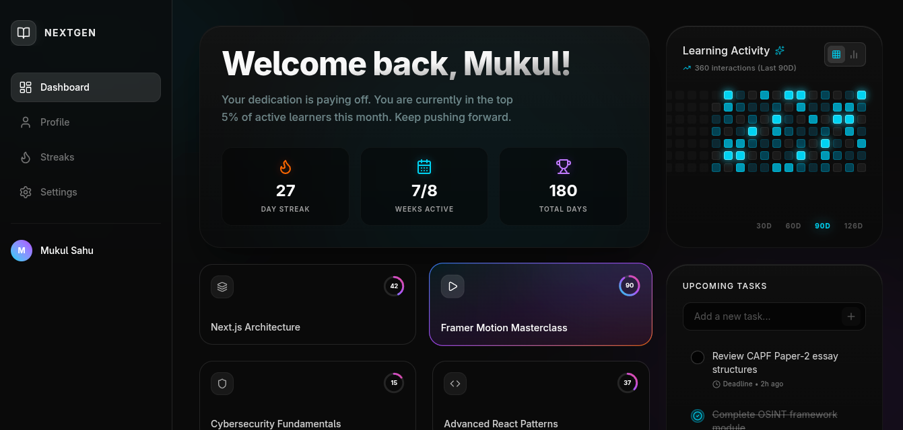
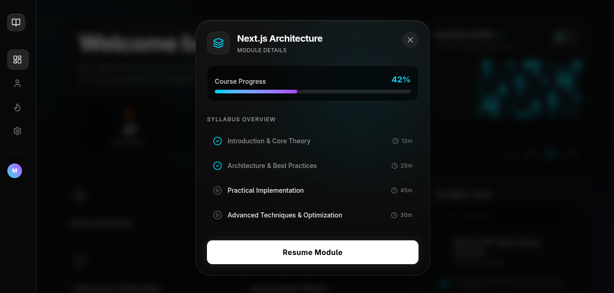

# NextGen Learning Dashboard




**Live Demo:** (https://learning-dashboard-pink.vercel.app/)

A high-performance, responsive e-learning tracking dashboard built with Next.js 15, Tailwind CSS, Framer Motion, and Supabase. Designed around a modern "Bento Grid" philosophy to provide a premium, luxury SaaS user experience.

## 🏗️ Architectural Choices
* **Bento Grid & CSS Geometry:** Utilized nested grids and `h-fit` flex containers to ensure cards wrap tightly without stretching into empty space. 
* **Zero Layout Shift UI:** Engineered a fixed-length "ghost cell" architecture (126 days) for the GitHub-style Activity Matrix. This ensures the component never changes physical size when toggling data ranges.
* **Micro-Interactions:** Leveraged Framer Motion for spring-physics entrance staggers, complex hover glows, and an `AnimatePresence` frosted-glass modal overlay.
* **Supabase (BaaS):** Chose Supabase as a lightweight, real-time PostgreSQL backend to store and serve course progression data securely.

## ⚡ Server / Client Component Split
This application strictly adheres to the Next.js App Router paradigm:
* **Server Components (Backend):** The root `page.tsx` operates entirely on the server. It directly awaits the Supabase database connection, fetching the live data before the page even loads. This keeps the database logic secure, reduces the JavaScript bundle size, and improves SEO/initial load times.
* **Client Components (Frontend):** Interactive components like `BentoGrid.tsx`, `CourseCard.tsx`, and `ActivityChart.tsx` are explicitly marked with `"use client"`. They are pushed to the "leaves" of the component tree to handle React state (`useState`), Framer Motion animations, and `onClick` modal triggers.

## 🧗 Challenges Faced & Solutions
1. **Supabase Row Level Security (RLS) Silent Blocks:** * *Challenge:* The Supabase client successfully connected but returned an empty array `[]` instead of throwing an error.
   * *Solution:* Identified that default RLS was blocking public reads. Created a dedicated "Enable read access for everyone" policy in the Supabase dashboard to securely allow the frontend to execute `select("*")` queries while blocking write/delete commands.
2. **TypeScript Strictness with Framer Motion in Production:**
   * *Challenge:* The Vercel build failed during the `npm run build` phase because TypeScript could not infer the strict types of the animation strings (e.g., `"spring"`).
   * *Solution:* Imported and applied the explicit `Variants` type from `framer-motion` to the animation objects, satisfying strict type-checking without compromising the physics configurations.
3. **Activity Matrix Text Collision:**
   * *Challenge:* Dynamic course titles collided with percentage indicators in the bar chart view.
   * *Solution:* Implemented strict flexbox constraints (`shrink-0 whitespace-nowrap` on the data, `truncate` on the titles) to ensure data remained legible while gracefully truncating long strings.

## 🛠️ Local Setup (Cross-Platform)
Whether you are on Windows, macOS, or Linux, follow these steps to run the project locally:

1. **Clone the repository:**
   ```bash
   git clone [https://github.com/YOUR_GITHUB_USERNAME/learning-dashboard.git](https://github.com/YOUR_GITHUB_USERNAME/learning-dashboard.git)
   cd learning-dashboard
   npm install 

2. **Set up Environment Variables:**

* Create a new file in the root directory named exactly .env.local
* Open the .env.example file and copy its contents into your new .env.local file.
* Replace the placeholder values with your actual Supabase project URL and Anonymous Key.

3. **Run the Development Server:**
```bash
   npm run dev


4. **Open http://localhost:3000 with your browser to see the result.**
